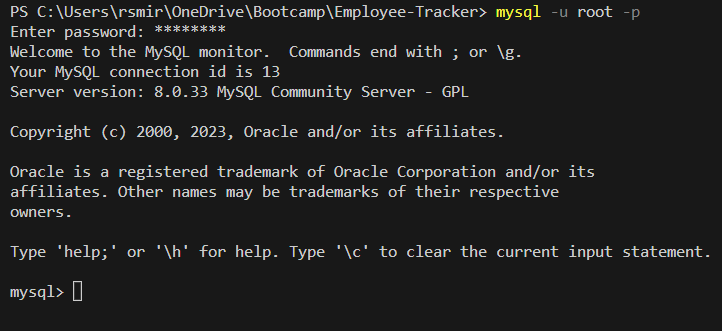
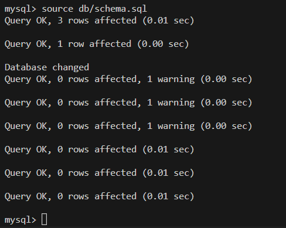
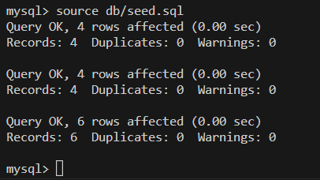
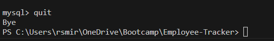
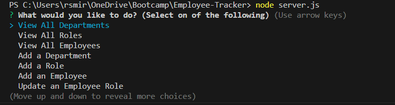

# EMPLOYEE-TRACKER

App for business to be more organized. Using this app the business will be able to view and manage their employees, departments and roles so that they can organize and plan their business better.

## Table of Contents
  * [Installation](#installation)
  * [Usage](#usage)  
  * [License](#license)
  * [Contributing](#contributing)  
  * [Questions](#questions)

## Installation

To install this app you will need to clone the repository from github (link bellow). 

https://github.com/renansm93/Employee-Tracker

## Usage

To run the program, run the code according to the video bellow.

https://drive.google.com/file/d/1CMv41M0u0HYYKVd7cAlodZh74NrRZ7cJ/view?usp=share_link

- Step 1: Open the MySQL CLI by typing mysql -u root -p (check you have MYSQL dowloaded on your machine)

* 

- Step 2: In the MySQL CLI, type 'source db/schema.sql'

* 

- Step 3: In the MySQL CLI, type 'source db/seed.sql'

* 

- Step 4: In the MySQL CLI, type quit to leave the MySQL

* 

- Step 5: Run 'node server.js' in the terminal 

* 

- Step 6: Now you are ready to use the app. Use any of the prompsts provided (View Employee, View Roles, Add employee, etc) 

## License

This application is covered by the  

## Contributing

* renansm93
* Any improvements or advice are always welcome.

## Questions

[Email me](mailto:rs.miranda93@gmail.com)

[Review my other projects on GitHub.](https://www.github.com/renansm93)